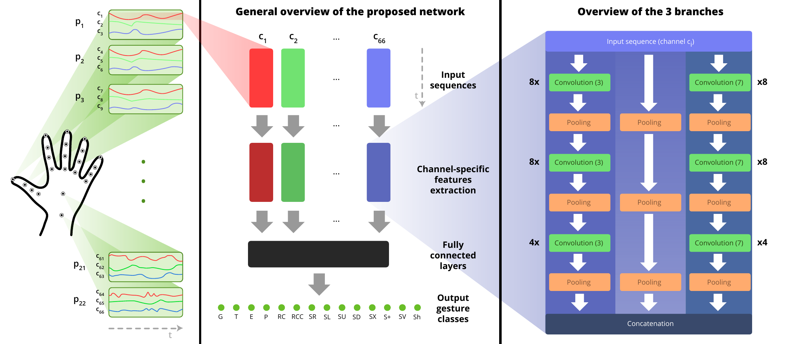

# TP Mines 2020:
L'idée est de mettre en commun l'algorithme Skelnet proposé par [G. Devineau, F. Moutarde, W. Xi and J. Yang](https://ieeexplore.ieee.org/document/8373818) et la partie encodeur d'un autoencodeur pour voir si l'application de Skelnet sur une représentation plus réduite et porteuse d'information permet d'améliorer les résultats de skelnet pour shrec 14 et 28 classes.

Dans ce repository, vous trouverez l'approche complete de Guillaume qui est forkée et une implémentation triviale d'auto-encodeur avec régularisation statistique en Keras (sans aucune optimisation quelconque)
Je vous recommande, de travailler en Keras (le code de Guillaume étant disponible en Keras et en Pytorch), mais si Pytorch vous convient et que vous souhaitez faire le TP en Pytorch et recoder l'autoencodeur modifié, aucun soucis.

Dans un premier temps je vous conseille de vous familiariser avec le concept d'auto-encodeur avec [une vidéo explicative](https://www.youtube.com/watch?v=g-KVHf0A2kI). 
Dans un second temps je vous conseille de vous intéresser à l'algorithme Skelnet présenté par Guillaume et al donc l'explication se trouve en dessous et le papier peut se trouver soit en demandant à Fabien soit sur internet.

Le principe dans notre cas est d'apprendre à reconstruire une action grâce à un auto-encodeur et récupérer la projection de chacune des actions dans l'espace réduit (ou espace latent ou bottleneck) puis d'appliquer Skelnet sur les données d'entrées transformées avec la partie encodeur.

Dans un certain sens, on espère avec l'autoencodeur capturer une certaine sémantique dans le jeu de données qui augmentera la capacité de classification de Skelnet

## Présentation de l'auto-encodeur modifié

Dans notre cas, nous travaillons sur un [auto encodeur modifié](https://github.com/JosephGesnouin/Mini_projet_Mines_2020_SkelnetAE/blob/master/SHREC/SHREC/Supervised_AE_Shrec_TP_Mines_2020.ipynb) avec une régularisation statistique pour conditionner la projection des instances dans l'espace latent en fonction de leur classe grâce à une analyse discriminante linéaire.

<p align="center">
  
</p>

Si vous souhaitez en savoir plus: Une explication de la démarche de l'[AE modifié](https://github.com/JosephGesnouin/Mini_projet_Mines_2020_SkelnetAE/blob/master/images/Compte_rendu_premiere_annee_JG(2).pdf)

Le code peut-être optimisé et n'est pas complet mais vous avez l'idée générale de l'approche: la fonction de cout modifié, la projection des classes du bottleneck via LDA, la visualisation de l'espace latent et le finetuning de la partie encodeur.

Je vous conseille de sauvegarder les poids via "bottleneck_model.save('AELDA.h5')" lorsque la fonction de cout est au plus bas et de load (load_model()) ce modèle pour la suite de l'approche (ce n'est pas dans le code mais nécéssite 1 ligne, je n'ai pas pris de le temps de le faire sur le drive et par conséquent elle est manquante)
## Problèmes possibles

Vous allez surement rencontrer quelques problèmes et en une semaine, certains peuvent être des points bloquants:
* Les données: De mémoire il faut faire une demande pour récupérer les données, le code de Guillaume n'est en réalité peut-être pas directement applicable, il faudra certainement regarder le format de son entrée vis-à-vis de ce que je vous donne comme données ([disponibles sur mon drive]( https://drive.google.com/drive/folders/18tsv-Aje8jUNLzLB4ZufjOtGEzpeI-jl?usp=sharing)
* La capacité de calcul: Travaillez sur Collab si vous n'avez pas de GPU

## Pipeline
Dans un premier temps, il vous faudra:

1. Entrainer un auto-encodeur pour la reconstruction d'action sur SHREC 14 et 28 ([code avec un notre AE modifié sur google drive sans aucune optimisation donnée]( https://drive.google.com/drive/folders/18tsv-Aje8jUNLzLB4ZufjOtGEzpeI-jl?usp=sharing), les données sur sont le drive, je vous recommande de télécharger le dossier directement)
2. Extraire la représentation des actions dans l'espace latent pour: l'ensemble de train et l'ensemble de test (code avec un MLP trivial sans aucune optimisation donnée)
3. Entrainer Skelnet sur les données extraites en 2 et évaluer les résultats.

## Idées à creuser
Il y'a plein d'idées à creuser vis-à-vis de l'approche:
* Dans un premier temps vous pouvez, au lieu de traiter le problème comme un problème à deux étapes, concatener le réseaux Skelnet à la partie encodeur de l'AE et finetuner l'approche, ce qui donnera une architecture optimisée de bout en bout.
* Optimiser l'architecture de l'auto-encodeur (gridsearch + au lieu de faire un MLP, faire du CNN, du LSTM ou de l'attention), optimiser les hyperparamètres(dropout, batch, optimizer:(adadelta, Adam, RMSProp), learning rate, fonctions d'activations, early_stopping, ReduceLronPlateau) et réaliser une première évaluation. 
* Jouer sur la taille de l'espace latent (itd=13) dans le code, et faire des visualisations via T-Sne dans le code puis faire une étude de l'importance de la taille de l'espace latent dans: la reconstruction de l'AE et la qualité de classification de l'approche complète.

## Si vous avez des problèmes bloquants
M'envoyer un mail à joseph.gesnouin@vedecom.fr ou joseph.gesnouin@mines-paristech.fr 
Bon courage et amusez vous bien :)

# Deep Learning for Hand Gesture Recognition

This repository holds a ```pytorch``` implementation of the deep learning model for hand gesture recognition introduced in the article [Deep Learning for Hand Gesture Recognition on Skeletal Data](https://ieeexplore.ieee.org/document/8373818) from G. Devineau, F. Moutarde, W. Xi and J. Yang.

## Getting started

A complete notebook is provided here: 
[Notebook for Deep Learning for Hand Gesture Recognition](deep_learning_hand_gesture_model_quickstart.ipynb)

The notebook includes gesture data loading, model creation, and model training. For convenience, the same notebook is also available as an interactive Google Colab: https://colab.research.google.com/drive/1TcfF3sNBOAXkQC5XU7tHMBfm0FYIC0UR



Additional details are provided below.

Description	Google Colab
1. Data Loading	https://colab.research.google.com/drive/1ggYG1XRpJ50gVgJqT_uoI257bspNogHj
2. Model: Keras	https://colab.research.google.com/drive/1DA3qlnT-HlN5aTvWbWT-ARDfaQIEZGfH
2. Model: PyTorch	https://colab.research.google.com/drive/1TcfF3sNBOAXkQC5XU7tHMBfm0FYIC0UR

---

## Model overview

##### Summary

A deep learning model, i.e. a neural network (middle), is used to classify hand gestures. The neural network uses a sparse representation of the hand (left). The neural network extracts motion features, using a dedicated temporal feature extractor (right) made of temporal convolutions. These temporal features are finally used to determine the nature of the gesture performed.

##### Model input

Studies on human visual perception of biological motion ([Johansson 1973](https://link.springer.com/article/10.3758/BF03212378)) have shown that humans can recognize human body motion actions, using the motion of the body's (skeletal) joints positions only, as you can see on [this youtube video](https://www.youtube.com/watch?v=rEVB6kW9p6k).

Such skeletal (“pose”) representations are lightweight and very sparse compared to image and video representations.

Some sensors directly provide streams of body skeletons or hand skeletons: e.g. Leap Motion, Kinect camera, RealSense camera, or motion capture suits and gloves. It is also possible to extract the pose information from videos using vision-based approaches like [OpenPose](https://github.com/CMU-Perceptual-Computing-Lab/openpose), [AlphaPose](https://github.com/MVIG-SJTU/AlphaPose), or [Google’s](https://github.com/google/mediapipe/) [Media Pipe](https://ai.googleblog.com/2019/08/on-device-real-time-hand-tracking-with.html) at a good frame rate.

<p align="center">
  
</p>

Each hand joint typically has 2 or 3 dimensions, to represent its (x,y) or (x,y,z) position in space at a given timestep. A gesture is thus represented by a sequence over time of `n_joints` (e.g. 22 joints in the image above) joints, or, equivalently by a sequence over time of  `n_channels` (e.g. 66 channels = 22 joints x 3 channels: for x, y and z position of the joint).

The model use such sequences as input. 

##### Finding temporal features

The key idea of the model is to extract relevant features to classify the gesture, based on the temporal evolution of each channel/signal. (The extracted features will later be used to perform the classification.)

Each channel is processed separately.

For performance, the temporal feature extraction processing is split into three parallel branches that are later merged.

<p align="center">
  
</p>

Let’s describe the first one (left). To extract temporal features for each individual 1D channel (e.g. let’s say the channel representing the `y` position of the wrist), the neural network uses 1D convolutions over time. The network use 3 convolutional and pooling layers to get a better representation.

In order to deal with different time resolutions, this processing branch is actually present twice (left and right) in the temporal feature extraction module, but with different sizes –time resolutions– for the convolution kernel.

A third, pooling-only, branch (middle) is added in order to help the backpropagation during the training.

Finally, for each channel, the outputs computed by the three branches are concatenated into a single output.

##### Gesture classification

Once features have been extracted for each channel, they need to be “merged”.

To that extent, they are all fed into a dense neural network (one hidden layer) which performs the final classification.

The full model (by-channel temporal feature extraction + final MLP) is differentiable and can be trained end-to-end.

---

### Training the model with your own gestures

Recognizing hand gestures can be useful in many daily real-life situations: writing, drawing, typing, communicating with sign language, cooking, gardening, driving, playing music, playing sport, painting, acting, doing precise surgery, pointing, interacting with one’s environment in augmented reality or virtual reality, for drone control, lights control, sound control, home automation, medicine, nonverbal communication, … the list is almost limitless!

##### A. Get hand pose sequences

If you only have videos of the gestures, first use a vision-based approach to generate hand pose/skeletal representation of your sequences.

For instance, you can use the CMU's OpenPose demo:  https://github.com/CMU-Perceptual-Computing-Lab/openpose or Google's MediaPipe https://github.com/google/mediapipe/blob/master/mediapipe/docs/hand_tracking_mobile_gpu.md

You can also use motion capture gloves, or dedicated sensors (Leap Motion, RealSense camera, ...) that directly provide such sequences.

If you don't have any hand gesture available or if you want to reproduce the results of the research article, you can also download the [DHG-14/28 Dataset](http://www-rech.telecom-lille.fr/DHGdataset/) or the [SHREC’17 Track Dataset](http://www-rech.telecom-lille.fr/shrec2017-hand/). To preprocess the two datasets, and load them with a single line of code, [please follow the instructions provided here](https://github.com/guillaumephd/deep_learning_hand_gesture_recognition/issues/1).

##### B. Data format

The model expects gestures to be tensors of the following shape: ```(batch_size, duration, n_channels)```.

For instance, if you want to recognize a batch of 32 gestures of length 100 on a hand skeletal constituted of 22 joints in 3D (x,y,z), i.e. 22x3=66 channels, the shape of the tensor should be : ```(32, 100, 66)```.

##### C. Load the gesture sequences data

First change the ```load_data()``` and the functions just below it to load your own data (section 2 of the notebook).

Then load it (section 4 of the notebook).

##### D. Train the model

Specify how many gesture classes you have and how many hand channels (not joints) you have (section 4 of the notebook).

You can now train the model on your own model.

##### E. Training tips

1. You should always visualize the metrics (loss, accuracy, ...; both for train/test/validation) of the model during the training. You can use ```tensorboard``` for that (see notebook for more details).

1. If the validation error starts increasing you've likely already been overfitting for a few epochs
2. If you encounter some ```pytorch``` error, ensure that your labels are in the correct range of values, and that the gesture tensor shape is correct
3. If the accuracy curves are too noisy or not smooth enough, consider decreasing the optimizer's learning rate
4. You can use data augmentation to improve the model performance

---

### Requirements

The notebook will run fine with:

- `python 3`

- `pytorch 1.0` and above

- Usual pip modules: `numpy` `sklearn` `scipy`

Optional: if you want to monitor the neural network’s metrics during training, you’ll also need ```tensorboardX``` and ```tensorboard``` (the latter is provided by ```tensorflow```)

### Citation

If you find this code useful in your research, please consider citing:

```
@inproceedings{devineau2018deep,
  title={Deep learning for hand gesture recognition on skeletal data},
  author={Devineau, Guillaume and Moutarde, Fabien and Xi, Wang and Yang, Jie},
  booktitle={2018 13th IEEE International Conference on Automatic Face \& Gesture Recognition (FG 2018)},
  pages={106--113},
  year={2018},
  organization={IEEE}
}
```
